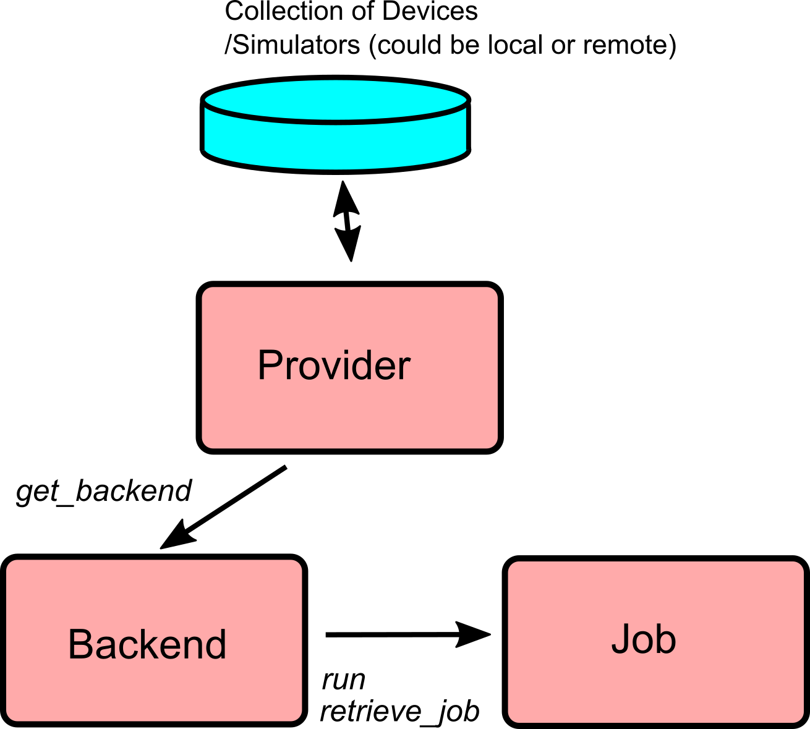

# Integrating OpenPulse into QISkit
Title: Integrating OpenPulse into QISkit

Author: Thomas Alexander

Email: talexander@ibm.com

Copyright: IBM 2018

Keywords: OpenPulse, QISkit

Date: August 31, 2018

## Overview

The goal of *OpenPulse* is to provide direct level pulse access to researchers and other end users of *IBM*'s and *QISkit* enabled quantum computers. The spec has been released [here--insert when live](arxiv.org).

OpenPulse lays out a specification for providers to implement.


Providers implement the *backend* which is capable of supplying its configuration in JSON form through an endpoint, backends will also supply a *default configuration* which specifies the default settings of user configurable parameters. Providers accept experiments in the form of a JSON *QObj*. Qobj have one of two forms, *QASM* which provides only *QASM* instructions and *PULSE* which may contain a combination of OpenQASM and OpenPulse instructions. This versions backends allowing them to either accept only QASM or both QASM and PULSE.

Endpoints provided by providers:

| Provider             | Backend         | Job         |
|----------------------|-----------------|-------------|
| `get_backend`        | `configuration` | `status`    |
| `available_backends` | `properties`    | `done`      |
|                      | `defaults`      | `running`   |
|                      | `schema`        | `cancelled` |
|                      | `status`        | `job_id`    |
|                      | `run`           | `backend`   |
|                      | `jobs`          | `cancel`    |
|                      | `retrieve_job`  | `result`    |

The client requires tools and interfaces to easily build Qobjs in order to run experiments. Qiskit currently provides this behavior for OpenQASM experiments with its `QuantumCircuit`, `Unroller` and `transpiler`. Moving forward Qiskit plans to designate the `DAGCircuit` as the reference circuit implementation and all representations will compile to/from this. Consequently there will be less of an emphasis placed on the QuantumCircuit, which will more or less become a builder for the `DAGCircuit` The aim of this proposal is to outline a path for integrating PULSE in QISkit.

## Design and Questions
- Builder for pulse experiments, `PulseBuilder`.
  - `PulseBuilder` has list of `Command`s.
  - `Command` is OpenPulse command ie.
    - `InputPulse`
    - `Acquire`
    - `FrameChange`
    - ...
  - `CompositeCommand` is grouping of commands
     on multiple qubits.
  - Enforces proper time sequencing for commands ie. no overlap.
  - Commands apply to qubits.
  - How are qubits represented?
    - Qubits are physical as a given pulse will only apply to its respective qubit.
    - Builder could consume configuration on initialization
      - Optionally consumes `BackendDefaults`.
      - Builder then creates list of:
        - `QuantumRegister`s
        - `ClassicalRegister`s
        - `MemorySlot`s
      - Builder creates `PulseLibrary` (list) that stores
        pulses.
  - `cmd_def` is returned from `backend_defaults`.
    - `QuantumCircuit` will define new `Instruction`
      `InstructionCommand`.
        - `InstructionCommand` relates a PULSE `Command` to a QASM `Instruction`
    - On initialization `PulseBuilder` builds a `InstructionCommand` hash table (`dict`) from `cmd_def`.
      - Ie. to request instruction for CX gate from qubit 1
        to qubit 2
        - `experiment.instruction['cx'][(qc1,qc2)]`
        - Handles instruction directionality.
    - `Experiment` initializes with `PulseBuilder`
      - `Experiment` consists of list of `PulseBuilder` instructions


  - `Kernel` callable on measurement result.
    - Returns filtered measurement result.
    - Not on backend.
    - Extension may provide common implementations
  - `Discriminator` callable on measurement result.
    - Returns discriminated measurement result.
    - Not on backend.
    - Extension may provide common implementations

- How do we build `PULSE` from `QASM`?
  - Desire a given `QuantumCircuit` to be compiled to pulse
    `Experiment`.
  - `QuantumCircuit` builds to `DAGCircuit`
  - `Experiment` builds to `DAGScheduler`
  - `compile` is passed list of `QuantumCircuits`,`Experiments`,`PulseBuilder` and `layout`.
  - 


### Rudimentary API definition

Memory slot which inherits from `Register`(for now?). Storage for
acquisition results.
```python
class MemorySlot(Register?):
  """
  Memory slot for storage of measurement output.

  Object property types
  ---------------------
  size = int
  name = str
  """

  def __init__(self, size, name=None):
```
Pulses and pulse library
```python
### Returned by backend and supplied as part of
### Qobj
class PulseLibrary(dict):
  # dict containing complex pulse arrays
```
The Command class which defined commands inherit from with

```python
class Command(object):
    """
    Base command class.
    """
    def __init__(self):

class Acquire(Command):
    """
    Acquisition command

    Object property types
    ---------------------
    qubits = [QuantumRegister]
    memory_slots = [MemorySlot]
    registers = [ClassicalRegister]
    """

    def __init__(self, t0, duration, qubits, memory_slots,
                  registers=None, kernels=None, discriminators=None):

class InputPulse(Command):
    """
    Explicit pulse that is specified as array of samples.

    Object property types
    ---------------------
    pulse = Pulse
    t0 = int (Time object?)
    channel = DriveChannel
    conditional = ClassicalRegister
    """

    def __init__(self, pulse, t0, channel, conditional=None):


class FrameChange(Command):
    """
    Adds phase shift to all future pulses/gates.

    Object property types
    ---------------------
    t0 = int (Time object?)
    channel = DriveChannel
    phase = float (0 to 2 pi)
    """

    def __init__(self, channel, t0, phase):

class PersistentPulse(Command):
    """
    Pulse that holds value between experiments.

    Object property types
    ---------------------
    t0 = int (Time object?)
    channel = DriveChannel
    value = complex (max=1)
    """

    def __init__(self, channel, t0, value):

```
Experiments are built from a sequence of the above instructions. It will be necessary to enforce timing of pulses such that there is no overlap.
```python
class Experiment(object)
  """
  An experiment to be run and added to Qobj on compile time.
  Timing is enforced.

  Object property types
  ---------------------
  commands = [Command]
  registers = [Registers]
  measurement_map = [[QuantumRegister],...]
  definitions = OrderedDict
  """
  def __init__(self,*regs,name=None):

  def has_register(self, register):

  def combine(self,rhs):
    """
     combine two experiments if have compatible
     registers timing is taken as absolute.
    """

  def extend(self,rhs):
    """
    Extend an experiment by append the rhs to
    this experiment if registers are compatiable.
    If last time slot of `self` is $t_f$, then
    initial time of `rhs` is $t0=t_f+1$.
    """

  def add(self,register):
    """ Add register """


```
Experiment
For connecting *QASM* to *OpenPulse* we require

## Use Cases
Here we outline likely use cases for the OpenPulse api with Qiskit and how they would be implemented with the proposed API.
#### Characterize Qubit Rabi and Ramsey
**Objective**: Provider supplies a backend configuration and defaults (which specifies device hamiltonian and estimated parameters). Generate a series of Rabi/Ramsey experiments to parameterize the device and calibrate basis pulses for the device.

**Implementation**:

#### Qasm2Pulse
**Objective**: Provider supplies a backend configuration and defaults for a fully characterized *n* qubit system with basis `X`. The user specifies generic QASM code, generate an OpenPulse *QObj* for the device mapping `QuantumRegisters`->`qubits`. The user now enforces `QuantumRegister`->`qubit` mapping, how is the handled?

**Implementation**:

#### Dynamical Decoupling
**Objective**: Provider supplies a backend configuration and defaults for *n* qubit system. User wishes to take raw pulses from the backend and inject dynamically decoupling of nearest neighbor qubits for a specific gate.

**Implementation**:

#### Pulse Optimization
**Objective**: Provider supplies a backend configuration and defaults for *n* qubit system. The user supplies a *QASM* experiment and wishes to optimize the output waveforms to filter frequency components. The user then wishes to optimize the QASM so as to optimize some cost function which is a function of both gate depth and net experiment time (requiring communication between both the Transpiler and the Scheduler).

**Implementation**:


## Process


### Research/Questions
- How are channels handled?
    - We could create channel object?
- How do we handle qubits?
    - Qubit object?
- How to handle QASM component
- Mapping `QuantumRegister` and `ClassicalRegister` to specific qubit/register.
    - How do we handle measurement map?
- Should memory slots be Register subclass?
- What failure mode do we want for pulse mismatching? In OpenPulse spec users supply the explicit initial time for pulses. It will be very easy for two pulses to be supplied which may overlap (as opposed to a sequential command scheme). How should validation and failure be handled?
- Should objects be created for Kernels and Discriminators?


### Testing

The development of the *OpenPulse*, *QISkit* interface will be completed in parallel with the *OpenPulseSimulator* which itself will be eventually included in *qiskit-terra*. The interface outlined in this document will be used to write tests to generate QObj experiments for the simulator. These will test the validity of the generated QObjs and its overall implementation.

A series of tests will be written to generate JSON QObjs for OpenPulse and QASM with the output being validated against schemas.

A series of tests following those written for QASM code will be written. **TODO-- Add specfic**.

### Timeline
Below is a rudimentary timeline.

- Week 1 (Sept 10-14)
    - Nail down API.
    - Begin implementation
- Week 2 (Sept 17-21)
    - Rudimentary functioning API
    - Write simple test for OpenPulse simulator
    - Submit [WIP] PR
- Week 3 (Sept 24-28)
    - Finish Qiskit tests
    - Implement PR suggestions
- Week 4 (Oct 1-5)
    - Write OpenPulse simulator tests
- Week 5 (Oct 8-12)
    - Example OpenPulse simulator backend with pulse design (simple gaussian pulses) and tuned gates for reference tests. The generation process written as a notebook.
